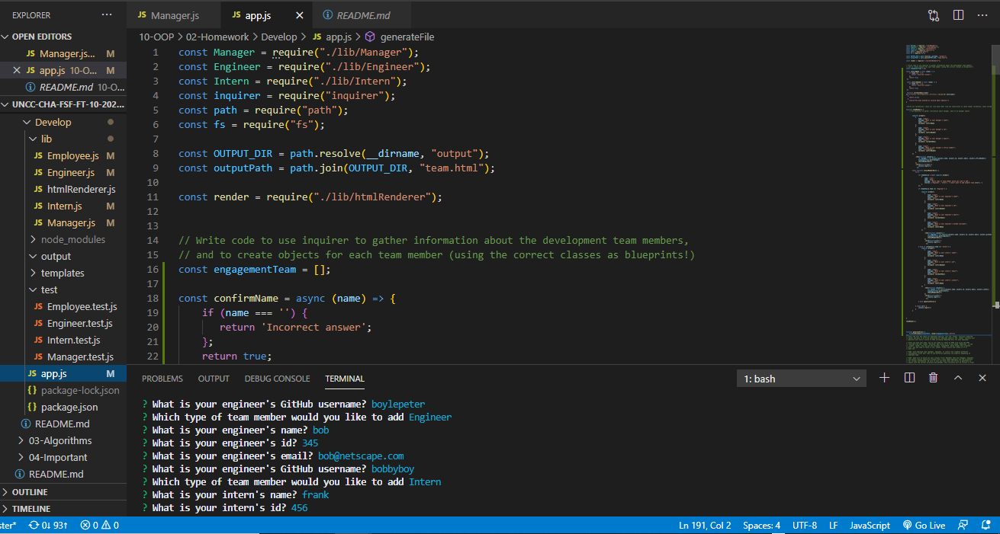
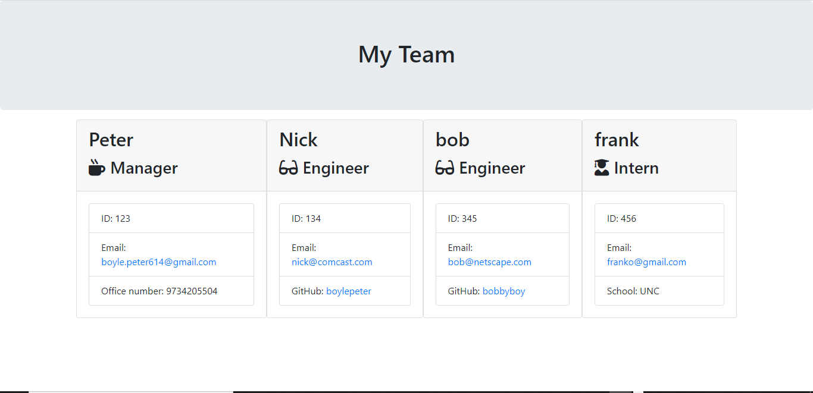

# Team Summary Template

## Description: 
Given the task of creating an application which would enable a manager to create a page with both general and specific information about a team, we employed a variety of technologies and approaches to provide a quality end product. We utilized HTML, Javascript, and node.js with object oriented programming to develop an app which will meet and exceed all tasks asked of us.
## Table of Contents

-[Description](#description)

-[Installation](#installation)

-[Instructions](#instructions)

-[Licenses](#licenses)

-[Deployed](#deployed)

-[Contact](#contact)

-[Contributors](#Contributors)

-[Testing](#Tests)

## Installation:
The application is available via the owners github page (linked below). It requires the addition of the jest and inquirer npm. 
## Instructions:
Through the use of a simple and easy to use command line prompt, the project lead or manager can simply input team data, with a clean, legible, and straight forward team outline page being the end product.
### Licenses: 

### Deployed: 
[https://github.com/boylepeter/Team_Summary_Template](https://github.com/boylepeter/Team_Summary_Template)
[App Demonstration Video](https://drive.google.com/file/d/1XiXSLRNsCHdkc88RmlNmn6jO-N4JYyFE/view)

### Contact:

[Github](https://github.com/boylepeter/Team_Summary_Template)

[LinkedIn](https://www.linkedin.com/in/peter-boyle-22b5071b7/)

Email: [Boyle.Peter614@gmail.com](Boyle.Peter614@gmail.com)

### Contributors: 
None

### Tests: 
Please feel free to utilize the app yourself on your next team based assignment. In addition we have a test folder with a series of jest based tests which you can run or watch on the attached video. If you have any comments or suggestions, please feel free to get in contact.
